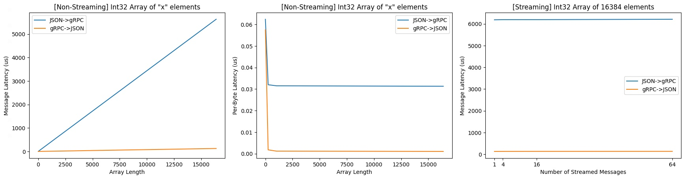
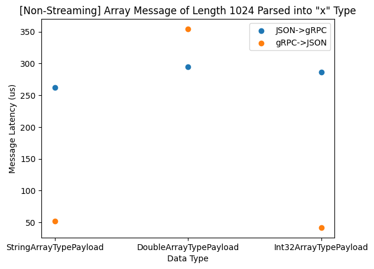
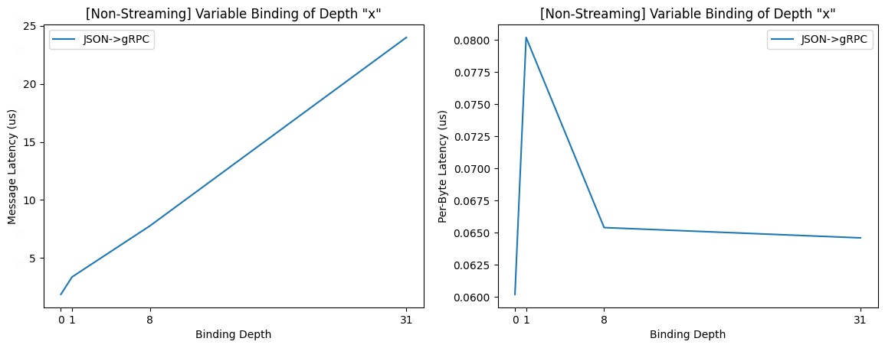
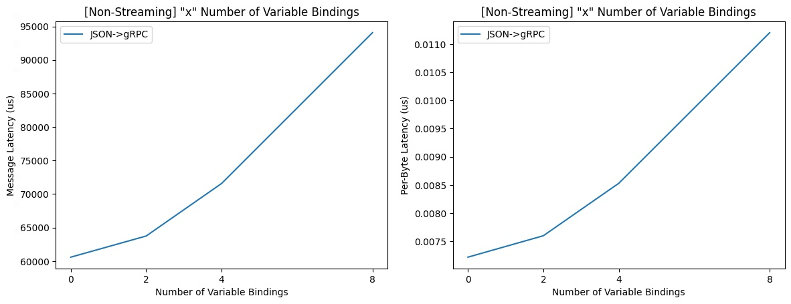

# Performance Benchmark

We use [Google Benchmark](https://github.com/google/benchmark) library to build
our performance benchmark. Variable being tested

- Number of nested JSON layer
- Array length
- Value data type
- Body length
- Number of message segments (JSON -> gRPC only)
- Variable binding depth (JSON -> gRPC only)
- Number of variable bindings (JSON -> gRPC only)

## How to run

```bash
bazel run //perf_benchmark:benchmark_main --compilation_mode=opt -- \
  --benchmark_min_warmup_time=3 \
  --benchmark_repetitions=1000 \
  --benchmark_format=console \
  --benchmark_counters_tabular=true \
  --benchmark_filter=BM_*
```

Options meaning:

- `--compilation_mode=opt`: Bazel option to build the library in release mode.
  Without this, the library runs in debug mode.
- `benchmark_min_warmup_time=<int>`: the amount of time for which the warmup
  should be run
- `benchmark_repetitions=<int>`: the test will automatically run several
  iterations, but only one data point is captured per run. Setting repetition to
  1000 gives us 1000 data points, which would make percentiles and standard
  deviation more meaningful.
- `benchmark_format=<console|json|csv>`: where to output benchmark results.
- `benchmark_counters_tabular=<true|false>`: it's useful when outputting to
  console.
- `benchmark_filter=<regex>`: it can be used to only run the benchmarks that
  match the specified <regex>.

## Captured data

- Elapsed time and CPU time
- Byte latency and throughput
- Message latency and throughput (message latency should equal to CPU time).
- Request latency and throughput

We also capture p25, p50, p75, p90, p99, and p999 for each test,
but `--benchmark_repetitions=1000` is recommended for the results to be
meaningful.

## Benchmark Results

### Environment Setup
We ran the benchmark on the `n1-highmem-32` machines offered from Google Cloud Kubernettes Engine (GKE). The request memory and cpu are `512Mi` and `500m` respectively, and the limit memory and cpu are `2Gi` and `2` respectively. The transcoder and benchmark binaries run in a single-thread, so vCPU with 2 cores is sufficient.

The benchmark was started using the following arguments
```
--benchmark_repetitions=1100 \
--benchmark_counters_tabular=true \
--benchmark_min_warmup_time=3 \
--benchmark_format=csv
```

Below, we present the visualization using the median values among the 1100 repetitions.

### Number of Nested Layers
There are two ways to represent nested JSON structure - using a recursively defined protobuf message (`NestedPayload` in `benchmark.proto`) or using `google/protobuf/struct.proto`. We benchmarked the effects of having nested layers during the transcoding.

- The performance of `google/protobuf/struct.proto` is worse than a recursively defined protobuf message in both JSON -> gRPC and gRPC -> JSON cases. 
- Transcoding for gRPC -> JSON has a much better performance.
- Transcoding streamed messages doesn't add extra overhead.
- The per-byte latency of nested structure does not conform to a trend.


### Array Length
We benchmarked the effects of varying array length during transcoding.

- Transcoding for JSON -> gRPC has much worse performance than transcoding for gRPC -> JSON. 
- The per-byte latency for non-streaming message converges when the array length is over 1024 - 0.03 us for JSON -> gRPC and 0.001 for gRPC -> JSON.
- Streaming messages has almost little overhead.



### Body Length
We benchmarked the effects of a message containing a single `bytes` typed field with varying data length.

- Transcoding for JSON -> gRPC has worse performance than transcoding for gRPC -> JSON. 
- The per-byte latency for non-streaming message converges to 0.01 us for JSON -> gRPC and 0.005 us for gRPC -> JSON. 
- Streaming messages has almost little overhead.

_Note: The JSON representation of `bytes` typed protobuf field is encoded in base64. Therefore, 1 MiB sized message in gRPC would have roughtly 1.33 MiB in JSON. The per-byte latency is calculated using the unencoded data size, which is why the per-byte latency would gives around 34000 for 32 MiB of data, whereas the message latency for 32 MiB is actually around 50000._


### Number of Message Segments
We benchmarked the effects for messages arrive in segments. This only applies to JSON -> gRPC since gRPC doesn't support incomplete messages. Currently, the caller needs to make sure the message arrives in full before transcoding from gRPC.

- There is a noticeable increase when the number of message segment increase to more than 1. 
- The overhead scales up linearly as the number of message segments increases.
- The effect of having segmented message becomes less when the message is streamed.


### Value Data Type
We benchmarked transcoding from an array of zeros `[0, 0, ..., 0]` into `string`, `double`, and `int32` type.

- `string` data type has the less overhead.
- `double` has the most significant overhead for transcoding.



### Variable Binding Depth 
We benchmarked the effects of having deeply nesetd variable bindings in JSON -> gRPC. There is no variable binding from gRPC -> JSON. Streaming benchmark doesn't apply here because the same insights can be collected from the JSON body length benchmarks.

- The overhead of a deeper variable binding scales linearly.
- Having nested variable bindings can introduce a noticeable overhead, but the per-byte latency drops as the number of nested layers grows.



### Number of Variable Bindings
Similarly, we benchmarked the effects of having multiple variable bindings in JSON -> gRPC.

- The overhead of a deeper variable binding scales linearly.


